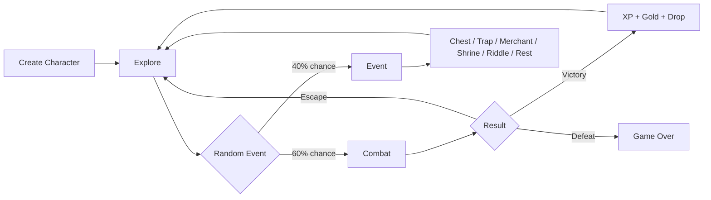

# ⚔️ OOP RPG

**[English version](README-ENGLISH.md)**

> A turn-based combat RPG made in Python with Tkinter — created to practice **Object-Oriented Programming** in a fun way.

---

## 📖 About the Project

**OOP RPG** is a desktop RPG with a graphical interface where you choose a class, explore dungeons, fight enemies, level up, and collect items. Every game mechanic was designed to exercise a different OOP concept: inheritance, polymorphism, encapsulation, abstract classes, and properties.

It is simple, a little messy around the edges, and fully functional — exactly what a learning project should be.

---

## 🧠 OOP Concepts Practiced

| Concept | Where it appears in the code |
|---|---|
| **Abstract Class** | `Personagem` (ABC) with abstract `atacar()` method |
| **Inheritance** | `Jogador` and `Inimigo` inherit from `Personagem`; specific enemies inherit from `Inimigo` |
| **Polymorphism** | Each enemy has its own `atacar()` — `Slime` regenerates, `LoboMutante` attacks twice |
| **Encapsulation** | Player stats are protected; equipment bonuses are calculated via `@property` |
| **Composition** | `Jogador` contains instances of `Item`, `Habilidade`, and equipment |
| **Properties** | `hp_max`, `mana_max`, `atk_total`, `dfn_total` with dynamic equipment bonuses |

---

## 🎮 Features

- **3 playable classes** — Warrior, Mage, and Rogue, each with unique attributes and abilities
- **Turn-based combat system** with basic attacks, abilities, and item usage
- **5 enemy types** + 2 bosses with distinct behaviors
- **Element system** with weaknesses and resistances (fire × ice)
- **Random events** while exploring: chest, trap, rest, merchant, shrine, and riddle
- **Complete inventory** with potions, bombs, elixirs, and stackable equipment
- **Equipment system** in 3 slots — weapon, armor, and accessory
- **Level up** with class-based attribute scaling
- **Graphical interface** with HP, MP, and XP bars in real time

---

## 🏹 Available Classes

| Class | HP | ATK | DEF | Mana | Highlight |
|---|---|---|---|---|---|
| ⚔️ Warrior | 50 | 12 | 4 | 15 | Highest HP and defense |
| 🧙 Mage | 35 | 4 | 1 | 50 | Powerful fire and ice spells |
| 🗡️ Rogue | 40 | 10 | 2 | 20 | Critical hit (35%) and 85% escape chance |

---

## 👾 Enemies

| Enemy | Element | Special Behavior |
|---|---|---|
| Goblin | Neutral | — |
| Slime | Neutral | Regenerates HP after attacking |
| Orc | Neutral | — |
| Skeleton | Neutral | High defense |
| Mutant Wolf | Neutral | 25% chance to attack twice |
| **Orc King (Boss)** | 🔥 Fire | Guaranteed Crushing Blow |
| **Dragon (Boss)** | 🔥 Fire | High stats |

Bosses appear every **5 battles won**.

---

## 🗺️ Game Flow



---

## ⚙️ Requirements

- Python **3.8+**
- `tkinter` — already included in the standard Python installation

> ⚠️ On Linux, you may need to install it separately:
> ```bash
> sudo apt-get install python3-tk
> ```

---

## 🚀 How to Run

```bash
# Clone or download the file
git clone https://github.com/seu-usuario/rpg-poo.git
cd rpg-poo

# Run directly
python rpg_poo.py
```

No external dependencies required.

---

## 📝 Development Notes

This project **is not meant to be a polished game** — it was built to reinforce OOP concepts while creating something fun to run and test.

---

*Made with Python, Tkinter, and a strong desire not to study OOP from a textbook.* 🐍
